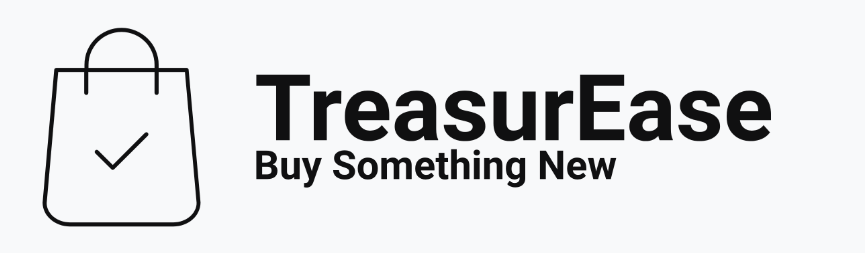
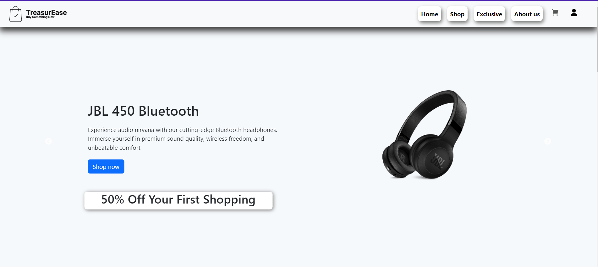
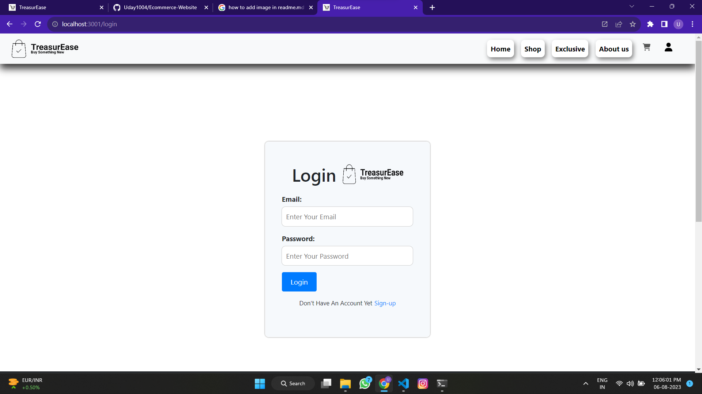
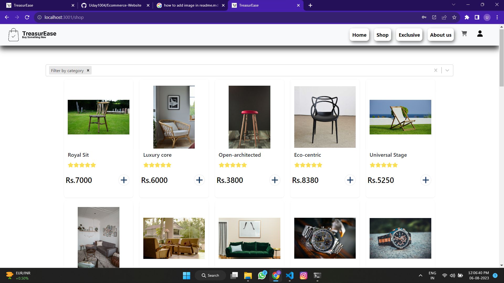
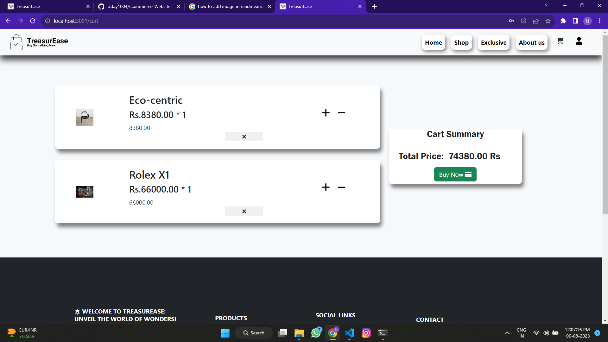

# TreasurEase E-Commerce Website 🛒 - ReactJS  

Welcome to our E-Commerce Website built using ReactJS! This project aims to provide a seamless and user-friendly online shopping experience. Below you'll find all the information you need to get started with the website, from features and technologies used to installation steps and more.



## Live Demo 👉 
 <span>Explore our live demo by clicking [here]().</span>
<b>Demo user:</b><br/>
Email: demo@gmail.com<br/>
Password: 123


## Features ✨
- User-friendly and responsive design
- Product categories and search functionality
- Product add to cart with pop up 
- Product details page with images, descriptions, and reviews
- Shopping cart with the ability to add/remove items
- User authentication with local storage
- Items added to local storage 

## Technology Used 🔧
- React.js ⚛️
- HTML 📄
- CSS 🎨
- JavaScript 🚀
- VS Code 🖥️
- Scss 🎨
- Git ⚙️
- Github ⚒️

## Store Image 🏪







## Installation and Setup 🚀
Follow these steps to run the E-Commerce website locally:
1. Clone the repository:
   ```
   git clone  https://github.com/Uday1004/Ecommerce-Website.git
   ```
2. Navigate to the project directory:
   ```
   cd  Ecommerce-Website
   ```
3. Install the dependencies:
   ```
   npm install
   ```
4. Start the development server:
   ```
   npm start
   ```
5. Open your web browser and visit `http://localhost:3000` to access the website.

## Feedback 💌
We value your feedback! If you encounter any issues or have suggestions for improvement, please feel free to [create an issue](https://github.com/Uday1004/Ecommerce-Website/issues) on our GitHub repository.


## Contribute 🤝
We welcome contributions to enhance the E-Commerce website. If you'd like to contribute, please follow our [contribution guidelines](CONTRIBUTING.md).

Happy shopping! 🛍️
